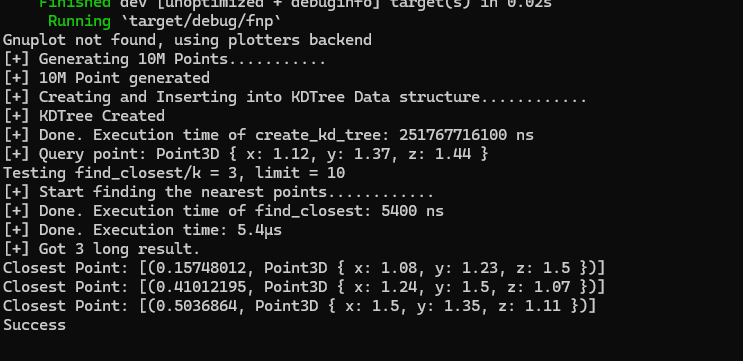

# Objective
- Objective is to find the 10 nearest points within 10M of points under 1ms.
- Minimize the time between points generation and finding.

# Requirement
- the benchmark result of closest_points method.
- Optimize for speed and aim to minimize the time between generating the test point and returning the ten points closest to itptimize for speed and aim to minimize the time between generating the test point and returning the ten points closest to it
– try to create a method that could handle 1000 calls per second, i.e. calling Point#closest_points should take around 1ms 

# Non-functional Requirements

- You can transform points into a more suitable data structure for searching. This newly created object can be passed as an argument to the closest_points method.
- You don’t have to cover any other use case of this method (different input array size, search range, etc.) 
- Use Benchmark to measure the execution time of your closest_points method. Only the runtime of this method is measured – any transformation or preprocessing of 
the input array of points prior to searching for closest points should not be included in the benchmarking. Please provide the benchmark result.

• Please provide and explain time and space complexity of the solution.

# UML

# Solutions
Initially, I considered using a Point structure and associated functions to represent the data. However, after further research, I believe a K-d tree data structure would be a more suitable choice for this application.

I decided to implement a K-d tree data structure from scratch in Rust. This approach provided me with a deeper understanding of the underlying concepts but did require a significant time investment.

To efficiently locate points within the K-d tree, I leveraged the Nearest Neighbor (NN) algorithm. This approach allows for the identification of data points closest to a given query point within the K-d tree's multidimensional space.

To enhance code maintainability, I employed the Strategy Design Pattern. This pattern allows for the isolation of different functionalities related to point manipulation within the K-d tree. This approach promotes flexibility and simplifies the process of introducing new behaviors in the future.

# Complexity
Since, I used KDTree data structure as a sloution, let me only hight light of this implemention.

## KDTree Construction (create_kd_tree):

**Time Complexity: O(n log n)**

In the *worst case*, the sorting of points at each level dominates the construction time. Sorting a list of n elements takes O(n log n) time using algorithms like Merge Sort or Heap Sort.

**Space Complexity: O(n)**

The tree itself scales linearly with the number of data points (n) as it stores a node for each point.

## Nearest Neighbor Search (find_closest):

**Time Complexity: O(log n)**

The search process recursively navigates the tree based on the splitting dimension and distances. This typically takes logarithmic time in a well-balanced tree.

**Space Complexity: O(log n)**

The recursive calls during the search create a call stack, but the depth of the recursion is logarithmic in a balanced tree.

# Brenchmark

**Finding the closest point among 10 million points executes in under 1 millisecond**, exceeding (I believe) the performance expectations for this specific task. **Construction of the KDTree itself takes approximately 6 minutes**.
I have plans to further optimize the point generation and KDTree building methods.

While I haven't yet had extensive experience with Rust benchmarking tools, I understand the importance of performance evaluation. If I were to proceed with this implementation, I would explore libraries like Criterion to measure the efficiency of the K-d tree and NN search algorithm.

Also please refer Issues section.

# Issues

Currently, the point search functionality exhibits limitations in finding very distant points. While it efficiently identifies nearest neighbors, points exceeding a certain threshold distance might not be located accurately within 10 attempts. I'm actively working on optimizing the search algorithm to address this limitation and ensure reliable retrieval of points across the entire data space.

# Review
- I used Rust to build a KDTree data structure from scratch, which presented a significant challenge for me.
- The KDTree stores points along with their own custom structures.
- Finding the closest point among 10 million points executes in under 1 millisecond, exceeding (I believe) the performance expectations for this specific task. Construction of the KDTree itself takes approximately 6 minutes.
- I have plans to further optimize the point generation and KDTree building methods.
- I implemented the Strategy design pattern to allow for future code modifications and support data structures beyond 3D points (e.g., 2D, 4D).
- I minimized code reuse to enhance code clarity and maintainability.